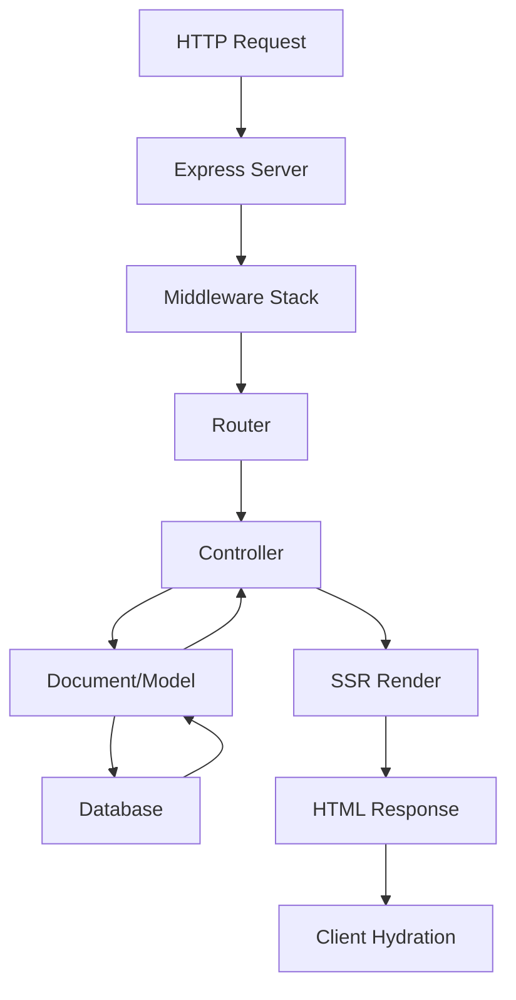

## Overview

Loopar Framework follows a modern full-stack JavaScript architecture that combines server-side rendering (SSR) with Vite, an Express.js backend, and a monorepo structure. The framework provides a unified environment for building data-driven applications with real-time updates and efficient bundling.

## Architecture Layers

Loopar's architecture consists of three main layers:

<CardGroup cols={3}>
  <Card title="Core Layer" icon="code">
    Framework core, document system, and ORM
  </Card>
  <Card title="Server Layer" icon="server">
    Express.js backend with routing and middleware
  </Card>
  <Card title="Client Layer" icon="browser">
    React + Vite with SSR and hydration
  </Card>
</CardGroup>

## Core Framework

The main `Loopar` class orchestrates the entire framework:

```javascript packages/loopar/core/loopar.js
export class Loopar extends Document {
  constructor() {
    super("Loopar");
    
    this.dateUtils = dateUtils;
    this.server = new Server();
    this.db = new SequelizeORM();
  }

  async init({ tenantId, appsBasePath }) {
    this.tenantId = tenantId;
    this.tenantPath = this.makePath(this.pathRoot, "sites", tenantId);
    this.pathCore = `${process.cwd()}/packages/loopar`
    this.appsBasePath = appsBasePath;

    this.auth = new Auth(
      this.authTokenName,
      this.getUser.bind(this),
      this.disabledUser.bind(this)
    );
    
    await this.initialize();
    await this.server.initialize();
  }

  async initialize() {
    console.log(`......Initializing Loopar.......`);
    
    await this.buildGlobalEnvironment();
    await this.loadConfig();
    await this.db.initialize();
    await this.build();
    await this.buildIcons();
    await tailwinInit(this.tenantId);
  }
}

export const loopar = new Loopar();
```

<Note>
  The `loopar` singleton instance is exported and used throughout the application as the main entry point to framework features.
</Note>

## Server Architecture

The server layer uses Express.js with Vite integration for development and production builds:

```javascript packages/loopar/core/server/server.js
export class Server extends Router {
  server = server;
  url = null;
  isProduction = process.env.NODE_ENV == 'production';

  async initialize() {
    if (this.isProduction) {
      server.use(compression());
      server.use(zstdMiddleware({
        root: 'dist/client',
        priority: ['zst', 'br', 'gz'],
      }));
    } else {
      this.vite = await createViteServer({
        server: {
          middlewareMode: true,
          hmr: {
            protocol: 'ws',
            port: parseInt(process.env.PORT) + 10000,
          }
        },
        appType: 'custom'
      });

      server.use(this.vite.middlewares);
    }

    await this.#exposePublicDirectories();
    server.use(useragent());
    this.#initializeSession();
    this.route();
    this.#start();
  }
}
```

### Development vs Production

<Tabs>
  <Tab title="Development">
    - **Vite Dev Server**: Integrated middleware mode for HMR (Hot Module Replacement)
    - **Fast Refresh**: Instant updates without full page reloads
    - **Source Maps**: Full debugging support with original source
    - **Port Offset**: HMR runs on `PORT + 10000`
  </Tab>
  <Tab title="Production">
    - **Static Assets**: Pre-built from `dist/client`
    - **Compression**: Multiple compression algorithms (zstd, brotli, gzip)
    - **Optimized Bundles**: Code splitting and tree shaking
    - **CDN Ready**: Static assets can be served from CDN
  </Tab>
</Tabs>

## Client Architecture

The client uses React with SSR for optimal performance:

### Server-Side Rendering

```jsx app/entry-server.jsx
import { renderToString } from "react-dom/server";
import { StaticRouter } from "react-router";

export async function render(url, __META__, req, res) {
  const { Workspace, View } = await Loader(__META__, "server");
  global.__REQUIRE_COMPONENTS__ = [];
  global.ENVIRONMENT = "server";

  const context = {};
  const HTML = renderToString(
    <Main
      location={url}
      __META__={{
        ...__META__,
        components: { Workspace, View }
      }}
      req={req}
      res={res}
    />,
    context
  );

  __META__.__REQUIRE_COMPONENTS__ = global.__REQUIRE_COMPONENTS__;
  return { HTML };
}
```

### Client-Side Hydration

```jsx app/entry-client.jsx
import ReactDOM from "react-dom/client";
import { BrowserRouter } from "react-router";

(async () => {
  const __META_SCRIPT__ = document.getElementById('__loopar-meta-data__');
  const __META__ = JSON.parse(__META_SCRIPT__?.textContent || "{}");
  const { Workspace, View } = await Loader(__META__, "client");

  ReactDOM.hydrateRoot(
    document.getElementById("__[loopar-root]__"),
    <BrowserRouter>
      <ErrorBoundary>
        <App
          __META__={{
            ...__META__,
            components: {Workspace, View},
            environment: "client"
          }}
        />
      </ErrorBoundary>
    </BrowserRouter>
  );
})();
```

<Warning>
  The client hydrates the server-rendered HTML, so ensure data consistency between server and client renders to avoid hydration mismatches.
</Warning>

## Request Flow

Here's how a typical request flows through the system:



1. **Request**: HTTP request hits Express server
2. **Middleware**: Authentication, session, body parsing
3. **Router**: Parses URL and determines document/action
4. **Controller**: Executes business logic
5. **Document**: Interacts with database through ORM
6. **SSR**: Renders React components to HTML
7. **Response**: Sends HTML to client
8. **Hydration**: Client takes over React tree

## Monorepo Structure

Loopar uses a monorepo structure with packages and apps:

```
workspace/
├── packages/
│   └── loopar/
│       ├── core/              # Core framework
│       │   ├── loopar.js      # Main class
│       │   ├── document/      # Document system
│       │   ├── controller/    # Controllers
│       │   └── server/        # Server layer
│       ├── src/
│       │   └── components/    # React components
│       └── apps/
│           └── core/          # Core modules
├── app/                       # Client entry points
│   ├── entry-server.jsx
│   ├── entry-client.jsx
│   └── Router.jsx
├── sites/                     # Multi-tenant data
│   └── [tenantId]/
│       ├── config/
│       └── uploads/
└── apps/                      # Custom applications
```

### Package Organization

<AccordionGroup>
  <Accordion title="Core Package">
    Contains the framework's core functionality:
    - Document system and ORM
    - Server and routing
    - Authentication and sessions
    - File management
  </Accordion>
  
  <Accordion title="Apps">
    Modular applications that extend functionality:
    - Core system modules
    - Custom business logic
    - Installable/uninstallable
  </Accordion>
  
  <Accordion title="Sites">
    Multi-tenant data storage:
    - Per-tenant configuration
    - Isolated uploads and assets
    - Theme customization
  </Accordion>
</AccordionGroup>

## Database Layer

Loopar uses Sequelize ORM for database abstraction:

```javascript
// Accessing the database
const user = await loopar.db.query('User')
  .where({ name: user_id })
  .orWhere({ email: user_id })
  .select('name', 'email', 'password', 'disabled', 'profile_picture')
  .first();

// Getting document data
const doc = await loopar.db.getDoc("System Settings", null, ["*"], { isSingle: 1 });

// Listing records
const rows = await loopar.db.getList('Module', ['name', 'icon'], { in_sidebar: 1 });
```

## Build System

The framework includes an automated build system that:

- **Builds References**: Creates document type registry from database
- **Generates Icons**: Pre-loads required Lucide icons for performance
- **Builds Modules**: Creates navigation structure from modules
- **Compiles Assets**: Processes Tailwind and other assets

```javascript packages/loopar/core/loopar/builder.js
async build() {
  console.log('......Building Loopar.......');

  await this.makeDefaultFolders();
  await this.buildRefs();
  
  // Build module navigation
  const groupList = await this.db.getList('Module Group', ['name', 'description']);
  
  // Write configuration
  await fileManage.setConfigFile('loopar.config', data);
  await this.loadConfig(data);
}
```

## Multi-Tenancy

Loopar supports multi-tenancy out of the box:

- **Tenant Isolation**: Separate directories per tenant
- **Shared Codebase**: All tenants run the same framework version
- **Custom Themes**: Per-tenant CSS and branding
- **Data Separation**: Database-level tenant isolation

## Next Steps

<CardGroup cols={2}>
  <Card title="Documents" icon="database" href="/concepts/documents">
    Learn about the Document system for data models
  </Card>
  <Card title="Controllers" icon="code" href="/concepts/controllers">
    Understand how controllers handle requests
  </Card>
  <Card title="Routing" icon="route" href="/concepts/routing">
    Explore the routing system
  </Card>
  <Card title="Components" icon="cube" href="/concepts/components">
    Build UI with React components
  </Card>
</CardGroup>