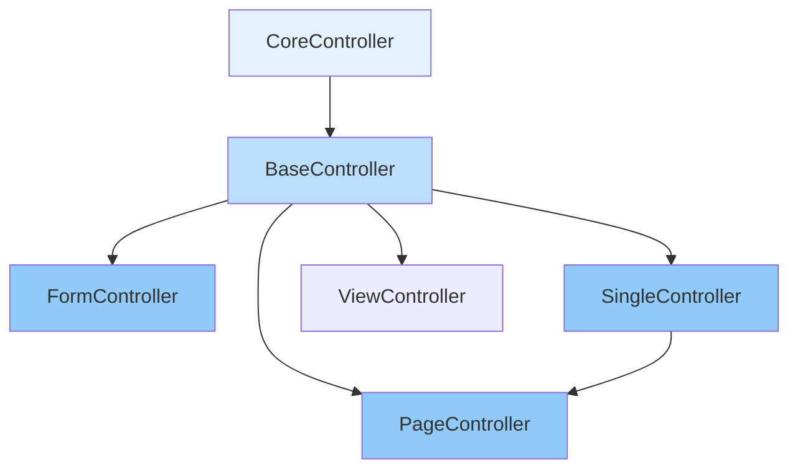

## Overview

Controllers in Loopar handle HTTP requests and coordinate between the routing layer and document models. They follow a convention-based system where actions map to methods, providing a clean MVC-like architecture.

## Controller Hierarchy

Loopar provides several controller types in an inheritance chain:



## BaseController

The `BaseController` provides core CRUD operations:

```javascript packages/loopar/core/controller/base-controller.js
export default class BaseController extends CoreController {
  defaultAction = 'list';
  hasSidebar = true;

  async actionList() {
    if (this.hasData()) {
      await loopar.session.set(this.document + '_q', this.data.q || {});
      await loopar.session.set(this.document + '_page', this.data.page || 1);
    }

    const data = Object.entries({ ...loopar.session.get(this.document + '_q') || {} })
      .reduce((acc, [key, value]) => {
        if (value && (value.toString()).length > 0 && value !== 0) {
          acc[key] = `${value}`;
        }
        return acc;
      }, {});

    const list = await loopar.getList(this.document, { 
      data, 
      q: (data && Object.keys(data).length > 0) ? data : null 
    });

    return await this.render(list);
  }

  async actionCreate() {
    const document = await loopar.newDocument(this.document, this.data);

    if (document.__ENTITY__.is_single) {
      return loopar.throw({
        code: 404,
        message: "This document is single, you can't create new"
      });
    }

    if (this.hasData()) {
      await document.save();
      return this.redirect('update?name=' + document.name);
    } else {
      Object.assign(this.response, await document.__meta__());
      return await this.render(this.response);
    }
  }

  async actionUpdate(document) {
    document ??= await loopar.getDocument(
      this.document, 
      this.name, 
      this.hasData() ? this.data : null
    );

    if (this.hasData()) {
      const Entity = document.__ENTITY__;
      const isSingle = Entity.is_single;
      await document.save();

      return await this.success(
        `${Entity.name} ${isSingle ? Entity.name : document.name} saved successfully`, 
        { name: document.name }
      );
    } else {
      return await this.render({ ...await document.__meta__(), ...this.response || {} });
    }
  }

  async actionDelete() {
    const document = await loopar.getDocument(this.document, this.name);
    await document.delete();

    return this.redirect('list');
  }

  async actionBulkDelete() {
    const names = loopar.utils.isJSON(this.names) ? JSON.parse(this.names) : [];

    if (Array.isArray(names)) {
      for (const name of names) {
        const document = await loopar.getDocument(this.document, name);
        await document.delete();
      }
    }

    return this.success(`Documents ${names.join(', ')} deleted successfully`);
  }
}
```

## Controller Actions

Actions are methods prefixed with `action` that handle specific operations:

<Tabs>
  <Tab title="List">
    **Display a list of documents**
    
    ```javascript
    async actionList() {
      const list = await loopar.getList(this.document, { 
        data, 
        q: searchQuery 
      });
      return await this.render(list);
    }
    ```
    
    - Handles pagination and search
    - Stores query state in session
    - Returns formatted list with metadata
  </Tab>
  
  <Tab title="Create">
    **Create new document**
    
    ```javascript
    async actionCreate() {
      const document = await loopar.newDocument(this.document, this.data);

      if (this.hasData()) {
        await document.save();
        return this.redirect('update?name=' + document.name);
      } else {
        return await this.render(await document.__meta__());
      }
    }
    ```
    
    - GET: Returns blank form
    - POST: Saves and redirects
  </Tab>
  
  <Tab title="Update">
    **Update existing document**
    
    ```javascript
    async actionUpdate(document) {
      document ??= await loopar.getDocument(
        this.document, 
        this.name, 
        this.hasData() ? this.data : null
      );

      if (this.hasData()) {
        await document.save();
        return await this.success('Saved successfully', { name: document.name });
      } else {
        return await this.render(await document.__meta__());
      }
    }
    ```
    
    - GET: Returns form with data
    - POST: Saves changes
  </Tab>
  
  <Tab title="Delete">
    **Delete document**
    
    ```javascript
    async actionDelete() {
      const document = await loopar.getDocument(this.document, this.name);
      await document.delete();
      return this.redirect('list');
    }
    ```
    
    - Checks for connections
    - Performs soft or hard delete
    - Redirects to list view
  </Tab>
</Tabs>

## Specialized Controllers

### FormController

For read-only form views:

```javascript packages/loopar/core/controller/form-controller.js
export default class FormController extends BaseController {
  constructor(props) {
    super(props);
    this.action !== 'view' && this.redirect('view');
  }

  async actionView() {
    const document = await loopar.getDocument(this.document, this.name);
    return await this.render(document);
  }
}
```

<Note>
  FormController automatically redirects all actions to `view`, making it perfect for read-only displays.
</Note>

### SingleController

For singleton documents (only one instance exists):

```javascript packages/loopar/core/controller/single-controller.js
export default class SingleController extends BaseController {
  client = "view";
  
  constructor(props) {
    super(props);
    this.action !== 'view' && this.redirect('view');
  }
}
```

**Use cases:**
- System Settings
- Application Configuration
- User Preferences

### PageController

For public-facing pages:

```javascript packages/loopar/core/controller/page-controller.js
export default class PageController extends SingleController {
  client = 'page';
  
  constructor(props) {
    super(props);
  }
}
```

**Features:**
- No authentication required
- Custom client rendering
- Public access

### ViewController

For custom view logic:

```javascript packages/loopar/core/controller/view-controller.js
export default class SingleController extends BaseController {
  client = "view";
  
  constructor(props) {
    super(props);
    this.action !== 'view' && this.redirect('view');
  }
}
```

## Custom Controllers

Create custom controllers by extending base classes:

```javascript
import BaseController from '@loopar/core/controller/base-controller.js';

export default class UserController extends BaseController {
  constructor(props) {
    super(props);
  }

  // Override default action
  async actionUpdate(document) {
    document ??= await loopar.getDocument(this.document, this.name, this.data);

    if (this.hasData()) {
      // Custom pre-save logic
      if (document.password && document.password !== document.protectedPassword) {
        document.password = loopar.hash(document.password);
      }
      
      await document.save();
      return await this.success('User saved successfully');
    }

    return await this.render(await document.__meta__());
  }

  // Custom action
  async actionResetPassword() {
    const user = await loopar.getDocument('User', this.name);
    
    const newPassword = loopar.utils.randomString(12);
    user.password = loopar.hash(newPassword);
    await user.save();

    // Send email
    await this.sendPasswordResetEmail(user, newPassword);

    return this.success('Password reset email sent');
  }

  // Custom action for AJAX
  async actionGetPermissions() {
    const user = await loopar.getDocument('User', this.name);
    const permissions = await user.getPermissions();
    
    return { permissions };
  }

  async sendPasswordResetEmail(user, password) {
    // Email logic
  }
}
```

## Request Flow

Here's how requests flow through controllers:

```javascript packages/loopar/core/server/router/router.js
async executeController(req, res, next, params, ref) {
  const makeController = async (query, body) => {
    // Import controller class
    const C = await fileManage.importClass(
      loopar.makePath(ref.__ROOT__, `${params.document}Controller.js`)
    );

    // Create controller instance
    const Controller = new C({
      ...params,
      ...query,
      data: RouterUtils.prepareFileData(body, req.files),
      __REQ_FILES__: req.files,
    });

    // Determine action
    const action = params.action?.length > 0 ? params.action : Controller.defaultAction;
    Controller.action = action;

    // Execute action
    const result = await Controller.sendAction(action) || {};

    // Handle result
    if (req.method === 'POST' || result.redirect) {
      req.__WORKSPACE__ = result;
    } else {
      req.__WORKSPACE__ = merge(
        req.__WORKSPACE__ || {},
        {
          Document: merge(result, {
            meta: { module: ref?.module }
          })
        }
      );
    }
  };

  // Handle multipart form data
  const contentType = req.headers['content-type'];
  const isMultipart = RouterUtils.isMultipartFormData(contentType);

  if (isMultipart) {
    return new Promise((resolve, reject) => {
      this.uploader(req, res, async err => {
        if (err) reject(err);
        try {
          resolve(await makeController(req.query, req.body));
        } catch (controllerErr) {
          reject(controllerErr);
        }
      });
    });
  }

  return await makeController(req.query, req.body);
}
```

## Controller Properties

Controllers have access to several properties:

<CodeGroup>
```javascript Request Data
this.data          // POST body data
this.files         // Uploaded files
this.query         // Query parameters
this.name          // Document name from URL
this.document      // Document type
this.action        // Current action
```

```javascript Helpers
this.hasData()           // Check if POST data exists
this.render(data)        // Render response
this.redirect(url)       // Redirect to URL
this.success(msg, data)  // Return success response
this.hasSidebar          // Show sidebar
this.defaultAction       // Default action name
```

```javascript Context
loopar.currentUser       // Current logged-in user
loopar.session           // Session manager
loopar.cookie            // Cookie manager
loopar.db                // Database connection
```
</CodeGroup>

## Response Methods

### Rendering

```javascript
// Render with SSR
return await this.render({
  Entity: { name: 'User', doc_structure: '...' },
  data: { name: 'john', email: 'john@example.com' },
  isNew: false
});
```

### Redirecting

```javascript
// Relative redirect
return this.redirect('list');

// Absolute redirect
return this.redirect('/desk/User/list');

// With query params
return this.redirect('update?name=' + document.name);
```

### AJAX Responses

```javascript
// Success response
return this.success('Operation completed', { 
  id: 123, 
  name: 'Result' 
});

// Error response
loopar.throw({
  code: 400,
  message: 'Validation failed'
});

// JSON response
return {
  status: 'success',
  data: results,
  count: results.length
};
```

## File Uploads

Controllers automatically handle file uploads:

```javascript
async actionUpload() {
  const files = this.files; // Array of uploaded files
  
  for (const file of files) {
    const fileManager = await loopar.newDocument('File Manager');
    fileManager.reqUploadFile = file;
    fileManager.app = this.__APP__;
    await fileManager.save();
  }

  return this.success('Files uploaded successfully');
}
```

## Middleware Integration

Controllers integrate with the middleware stack:

```javascript
// Authentication check
if (!loopar.currentUser?.name) {
  return this.redirect('/auth/login');
}

// Permission check
const hasPermission = await this.checkPermission('delete');
if (!hasPermission) {
  loopar.throw({
    code: 403,
    message: 'You do not have permission to delete'
  });
}

// Rate limiting
await this.checkRateLimit();
```

## Testing Controllers

```javascript
import UserController from './UserController.js';

describe('UserController', () => {
  it('should create user', async () => {
    const controller = new UserController({
      document: 'User',
      action: 'create',
      data: {
        name: 'test_user',
        email: 'test@example.com'
      }
    });

    const result = await controller.actionCreate();
    expect(result.name).toBe('test_user');
  });

  it('should handle validation errors', async () => {
    const controller = new UserController({
      document: 'User',
      action: 'create',
      data: {
        name: 'test_user'
        // Missing required email
      }
    });

    await expect(controller.actionCreate()).rejects.toThrow('email is required');
  });
});
```

## Best Practices

<Warning>
  **Security Considerations**
  
  - Always validate user input
  - Check permissions before sensitive operations
  - Sanitize data before database operations
  - Use transactions for multi-step operations
</Warning>

<Tip>
  **Performance Tips**
  
  - Cache frequently accessed data
  - Use preloaded mode for faster responses
  - Minimize database queries in loops
  - Implement pagination for large datasets
</Tip>

## Common Patterns

### Preloaded Mode

```javascript
if (this.preloaded == 'true') {
  return {
    instance: this.getInstance(),
    data: await document.values()
  }
}
```

### Conditional Logic

```javascript
if (this.hasData()) {
  // Handle POST request
  await document.save();
  return this.success('Saved');
} else {
  // Handle GET request
  return this.render(await document.__meta__());
}
```

### Error Handling

```javascript
try {
  await document.save();
  return this.success('Saved successfully');
} catch (error) {
  loopar.throw({
    code: 400,
    message: error.message
  });
}
```

## Next Steps

<CardGroup cols={2}>
  <Card title="Routing" icon="route" href="/concepts/routing">
    Learn how URLs map to controllers
  </Card>
  <Card title="Documents" icon="database" href="/concepts/documents">
    Understand the document system
  </Card>
</CardGroup>