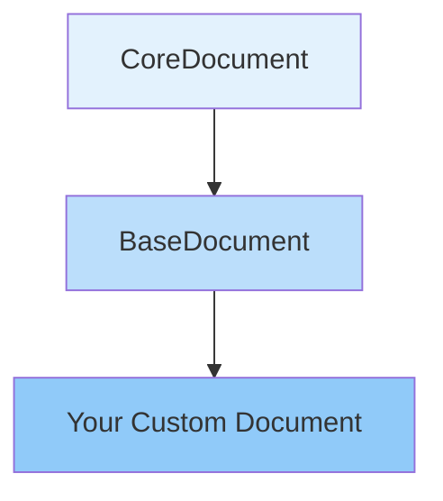

## Overview

The Document system is the foundation of data management in Loopar. Documents represent data models with automatic database mapping, validation, lifecycle hooks, and field management. Every data entity in Loopar extends from the Document base classes.

## Document Hierarchy

Loopar documents follow a three-tier inheritance structure:



- **CoreDocument**: Core field management, validation, and lifecycle methods
- **BaseDocument**: List views, filtering, and query building
- **Custom Document**: Your business logic and custom methods

## CoreDocument

The `CoreDocument` class provides the fundamental document functionality:

```javascript packages/loopar/core/document/core-document.js
export default class CoreDocument {
  #fields = {};
  #protectedPassword = "********";

  constructor(props) {
    Object.assign(this, props);
  }

  async __init__() {
    await this.#makeFields(JSON.parse(this.__ENTITY__.doc_structure));
    await this.setApp();
    await this.onLoad();
  }

  get fields() {
    return this.#fields;
  }

  async onLoad() {
    // Override in subclasses
  }
}
```

### Key Features

<CardGroup cols={2}>
  <Card title="Dynamic Fields" icon="sparkles">
    Fields are automatically created from entity metadata
  </Card>
  <Card title="Validation" icon="shield-check">
    Built-in validation for all field types
  </Card>
  <Card title="Lifecycle Hooks" icon="refresh">
    onLoad, validate, save, delete hooks
  </Card>
  <Card title="Child Tables" icon="table">
    Support for parent-child relationships
  </Card>
</CardGroup>

## BaseDocument

The `BaseDocument` extends CoreDocument with querying and list functionality:

```javascript packages/loopar/core/document/base-document.js
export default class BaseDocument extends CoreDocument {
  async getList({ fields = null, filters = {}, q = null, rowsOnly = false } = {}) {
    if (this.__ENTITY__.is_single) {
      return loopar.throw({
        code: 404,
        message: "This document is single, you can't get list"
      });
    }

    const pagination = {
      page: loopar.session.get(this.__ENTITY__.name + "_page") || 1,
      pageSize: 10,
      totalPages: 4,
      totalRecords: 1,
      sortBy: "id",
      sortOrder: "asc",
      __ENTITY__: this.__ENTITY__.name
    };

    const listFields = fields || this.getFieldListNames();
    const condition = combineSequelizeConditions(this.buildCondition(q), filters);
    
    pagination.totalRecords = await this.records(condition);
    pagination.totalPages = Math.ceil(pagination.totalRecords / pagination.pageSize);
    
    const rows = await loopar.db.getList(
      this.__ENTITY__.name, 
      [...listFields, "id"], 
      condition
    );

    return {
      labels: this.getFieldListLabels(),
      fields: listFields,
      rows: rows,
      pagination: pagination,
      q
    };
  }
}
```

## Creating Documents

There are two ways to work with documents:

### Creating New Documents

<Tabs>
  <Tab title="New Document">
    ```javascript
    // Create a new document instance
    const user = await loopar.newDocument('User', {
      name: 'john_doe',
      email: 'john@example.com',
      full_name: 'John Doe'
    });

    // Save to database
    await user.save();
    console.log('User created:', user.name);
    ```
  </Tab>
  
  <Tab title="Get Existing">
    ```javascript
    // Load existing document
    const user = await loopar.getDocument('User', 'john_doe');
    
    // Modify fields
    user.full_name = 'John M. Doe';
    user.email = 'john.m@example.com';
    
    // Save changes
    await user.save();
    ```
  </Tab>
</Tabs>

### Using the Document API

```javascript packages/loopar/core/loopar/document.js
export class Document extends Console {
  async getDocument(document, name, data = null, { ifNotFound = 'throw', parse = false } = {}) {
    return await documentManage.getDocument(document, name, data, { ifNotFound, parse });
  }

  async newDocument(document, data = {}) {
    return await documentManage.newDocument(document, data);
  }

  async deleteDocument(document, name, { sofDelete = true, force = false } = {}) {
    const Doc = await this.getDocument(document, name);
    await Doc.delete({ sofDelete, force, updateHistory });
  }

  async getList(document, { data = {}, fields = null, filters = {}, q = null } = {}) {
    const doc = await this.newDocument(document, data);
    return await doc.getList({ fields, filters, q });
  }
}
```

## Field Management

Fields are dynamically created based on the entity's `doc_structure`:

```javascript
async #makeField({ field, fieldName = field.data.name, value = null } = {}) {
  if (!this.#fields[fieldName]) {
    if (field.element === FORM_TABLE) {
      const val = loopar.utils.isJSON(value) ? JSON.parse(value) : value;
      this.#fields[fieldName] = new DynamicField(
        field,
        (Array.isArray(val) && val.length > 0) ? value : this.__DATA__[fieldName]
      );
    } else {
      this.#fields[fieldName] = new DynamicField(field, value || this.__DATA__[fieldName]);
    }

    // Create getter
    Object.defineProperty(this, `get${nameToGet(fieldName)}`, {
      get: () => {
        return this.#fields[fieldName];
      }
    });

    // Create property accessor
    Object.defineProperty(this, fieldName, {
      get: () => {
        return this.#fields[fieldName].value;
      },
      set: (val) => {
        this.#fields[fieldName].value = val;
      },
      enumerable: true
    });
  }
}
```

<Note>
  Fields are created as JavaScript properties with getters and setters, allowing natural property access like `user.email = 'new@email.com'`.
</Note>

## Lifecycle Hooks

Documents support various lifecycle hooks:

### Available Hooks

<AccordionGroup>
  <Accordion title="onLoad()">
    Called after document initialization. Use for setup logic:
    
    ```javascript
    async onLoad() {
      // Custom initialization logic
      this.computed_field = this.field1 + this.field2;
    }
    ```
  </Accordion>
  
  <Accordion title="validate()">
    Called before saving. Add custom validation:
    
    ```javascript
    async validate() {
      const errors = Object.values(this.fields)
        .filter(field => field.name !== ID)
        .map(e => e.validate())
        .filter(e => !e.valid)
        .map(e => e.message);

      const selectTypes = await this.validateLinkDocuments();
      errors.push(...selectTypes);

      errors.length > 0 && loopar.throw(errors.join('<br/>'));
    }
    ```
  </Accordion>
  
  <Accordion title="save()">
    Saves document to database with validation:
    
    ```javascript
    async save() {
      this.setUniqueName();

      if (validate) await this.validate();

      if (this.__IS_NEW__ || this.__ENTITY__.is_single) {
        await loopar.db.insertRow(
          this.__ENTITY__.name, 
          this.stringifyValues, 
          this.__ENTITY__.is_single
        );
        this.__DOCUMENT_NAME__ = this.name;
      } else {
        await loopar.db.updateRow(
          this.__ENTITY__.name,
          this.valuesToSetDataBase,
          this.__DOCUMENT_NAME__,
          this.__ENTITY__.is_single
        );
      }

      await this.updateHistory();
    }
    ```
  </Accordion>
  
  <Accordion title="delete()">
    Deletes document with connection checking:
    
    ```javascript
    async delete() {
      const { sofDelete, force, updateHistory } = arguments[0] || {};
      const connections = await this.getConnectedDocuments();

      if (connections.length > 0 && !force) {
        loopar.throw({
          ...{ VALIDATION_ERROR },
          message: `Cannot delete ${this.__ENTITY__.name}.${this.name} - it has connections`
        });
        return;
      }

      await loopar.db.beginTransaction();
      await this.deleteChildRecords(true);
      await loopar.db.deleteRow(this.__ENTITY__.name, this.__DOCUMENT_NAME__, sofDelete);
      updateHistory && await this.updateHistory("Deleted");
      await loopar.db.endTransaction();
    }
    ```
  </Accordion>
</AccordionGroup>

## Validation

Documents include automatic field validation based on field types:

```javascript
validatorRules() {
  var type = (this.element === INPUT ? this.data.format || this.element : this.element) || 'text';
  type = type.charAt(0).toUpperCase() + type.slice(1);

  if (this['is' + type]) {
    return this['is' + type]();
  }

  return { valid: true };
}

isEmail() {
  var regex = /^(([^<>()[\]\\.,;:\s@"]+(\.[^<>()[\]\\.,;:\s@"]+)*)|(".+"))@((\[[0-9]{1,3}\.[0-9]{1,3}\.[0-9]{1,3}\.[0-9]{1,3}\])|(([a-zA-Z\-0-9]+\.)+[a-zA-Z]{2,}))$/;
  return {
    valid: regex.test(this.value),
    message: 'Invalid email address'
  }
}

validatorRequired() {
  const required = [true, 'true', 1, '1'].includes(this.data.required);
  return {
    valid: !required || !(typeof this.value == "undefined" || this.value.toString().length === 0),
    message: `${this.__label()} is required`
  }
}
```

## Child Documents

Support for parent-child table relationships:

```javascript
async deleteChildRecords(force = false) {
  const ID = await this.__ID__();
  const childValuesReq = this.childValuesReq;

  if (Object.keys(childValuesReq).length === 0) return;
  
  for (const [key, value] of Object.entries(childValuesReq)) {
    if (key == this.name) continue;
    if (!await loopar.db.hasTable(key)) continue;
    
    const values = loopar.utils.isJSON(value) ? JSON.parse(value) : Array.isArray(value) ? value : null;

    if (values || force) {
      await loopar.db.sequelize.query(
        `DELETE FROM ${loopar.db.tableName(key)} WHERE parent_id = ?`,
        {
          replacements: [ID],
          type: Sequelize.QueryTypes.DELETE,
          transaction: loopar.db.transaction
        }
      );
    }
  }
}

get childValuesReq() {
  return Object.values(this.#fields)
    .filter(field => field.name !== ID && field.element === FORM_TABLE)
    .reduce((acc, cur) => ({ ...acc, [cur.options]: cur.value }), {});
}
```

## Querying Documents

### List with Filters

```javascript
// Get filtered list
const userList = await loopar.getList('User', {
  filters: { disabled: 0 },
  q: { name: 'john' },  // Search query
  fields: ['name', 'email', 'full_name']
});

console.log(userList.rows);
console.log(userList.pagination);
```

### Building Conditions

```javascript
buildCondition(q = null) {
  if (q === null) return {};

  Object.entries(q).forEach(([field, value]) => {
    if (!this.fields[field] || value === '') delete q[field];
  });

  const conditions = [];

  Object.entries(q).forEach(([key, value]) => {
    const field = this.fields[key];
    
    if (!field) return;

    if (value && value.toString().length > 0) {
      const isSelectType = [SELECT, SWITCH, CHECKBOX].includes(field.element);
      
      if ([SWITCH, CHECKBOX].includes(field.element)) {
        if ([1, '1'].includes(value)) {
          conditions.push({ [key]: 1 });
        }
      } else if (isSelectType) {
        conditions.push({ [key]: value });
      } else {
        conditions.push({ [key]: { [Op.like]: `%${value}%` } });
      }
    }
  });

  if (conditions.length === 0) return {};
  if (conditions.length === 1) return conditions[0];

  return { [Op.and]: conditions };
}
```

## Document History

Automatic tracking of document changes:

```javascript
async updateHistory(action) {
  if (loopar.installing) return;
  if (this.__ENTITY__.name !== "Document History") {
    const id = await this.__ID__();
    const hist = await loopar.newDocument("Document History");

    hist.name = loopar.utils.randomString(15);
    hist.document_id = id;
    hist.document_name = this.__DOCUMENT_NAME__;
    hist.document = this.__ENTITY__.name;
    hist.action = action || (this.__IS_NEW__ ? "Created" : "Updated");
    hist.date = dayjs(new Date());
    hist.user = loopar.currentUser?.name;
    
    await hist.save({ validate: false });
  }
}
```

## Custom Documents

Create custom document classes for specific entities:

```javascript
import BaseDocument from '@loopar/core/document/base-document.js';

export default class User extends BaseDocument {
  constructor(props) {
    super(props);
  }

  async onLoad() {
    // Initialize user-specific data
    this.display_name = this.full_name || this.name;
  }

  async validate() {
    await super.validate();
    
    // Custom validation
    if (this.email && !this.email.includes('@')) {
      loopar.throw('Invalid email format');
    }
  }

  async beforeSave() {
    // Hash password if changed
    if (this.password && this.password !== this.protectedPassword) {
      this.password = loopar.hash(this.password);
    }
  }

  async getPermissions() {
    // Custom method
    return await loopar.db.getAll('User Permission', ['*'], {
      user: this.name
    });
  }
}
```

## Best Practices

<Warning>
  **Important Considerations**
  
  - Always call `await user.save()` after modifying fields
  - Use `validate: false` only when absolutely necessary
  - Check for connections before deleting documents
  - Use transactions for multi-document operations
</Warning>

<Tip>
  **Performance Tips**
  
  - Use `fields` parameter to limit returned columns
  - Implement pagination for large datasets
  - Cache frequently accessed single documents
  - Use `rowsOnly: true` when you don't need metadata
</Tip>

## Document Parsing Utility

The `parseDocument` function processes document data and renders markdown fields based on the document structure definition.

```javascript
import { parseDocument } from 'loopar';

// Parse a document and render its markdown fields
const entity = 'Article';
const rawDoc = {
  id: 1,
  title: 'My Article',
  content: '## Hello\n\nThis is **markdown** content.',
  description: 'A regular field'
};

const parsedDoc = parseDocument(entity, rawDoc);
// parsedDoc.content is now rendered HTML
// parsedDoc.description remains unchanged
```

The function:
- Reads the document structure from the entity configuration
- Identifies fields with `MARKDOWN_INPUT` element type
- Renders markdown content to HTML using the markdown renderer
- Returns the processed document

This is useful when you need to display document data in the client with pre-rendered markdown fields.

## Next Steps

<CardGroup cols={2}>
  <Card title="Controllers" icon="code" href="/concepts/controllers">
    Learn how controllers interact with documents
  </Card>
  <Card title="Components" icon="cube" href="/concepts/components">
    Build forms for document data entry
  </Card>
</CardGroup>