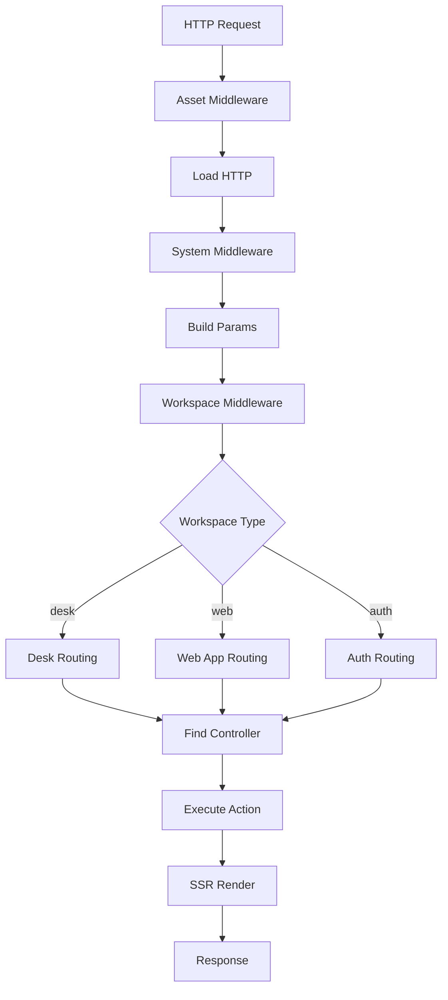

## Overview

Loopar's routing system handles both server-side and client-side routing, providing a unified interface for navigating between documents, actions, and workspaces. The router automatically maps URLs to controllers and determines the appropriate rendering context.

## URL Structure

Loopar uses a convention-based URL structure:

```
/{workspace}/{document}/{action}?{params}
```

<ParamField path="workspace" type="string" required>
  The application workspace: `desk`, `web`, `auth`, or `loopar`
</ParamField>

<ParamField path="document" type="string" required>
  The document type to access (e.g., `User`, `Invoice`, `Page`)
</ParamField>

<ParamField path="action" type="string">
  The action to perform: `list`, `create`, `update`, `view`, `delete`
</ParamField>

<ParamField query="params" type="object">
  Additional query parameters like `name`, `page`, filters
</ParamField>

### URL Examples

<CodeGroup>
```text List View
/desk/User/list
```

```text Create Form
/desk/Invoice/create
```

```text Update Form
/desk/User/update?name=john_doe
```

```text Web Page
/web/home
```

```text Authentication
/auth/login
```
</CodeGroup>

## Workspaces

Loopar supports multiple workspace contexts:

<Tabs>
  <Tab title="Desk">
    **Admin/Management Interface**
    
    - Full CRUD operations
    - Access to all documents
    - Requires authentication
    - Shows sidebar navigation
    
    ```
    /desk/User/list
    /desk/Invoice/create
    /desk/Settings/update
    ```
  </Tab>
  
  <Tab title="Web">
    **Public Website**
    
    - Public-facing pages
    - No authentication required
    - Custom page routing
    - Uses web app configuration
    
    ```
    /web/home
    /web/about
    /web/contact
    ```
  </Tab>
  
  <Tab title="Auth">
    **Authentication**
    
    - Login/logout pages
    - Password reset
    - User registration
    
    ```
    /auth/login
    /auth/logout
    /auth/reset-password
    ```
  </Tab>
  
  <Tab title="Loopar">
    **Framework Admin**
    
    - System configuration
    - Module management
    - Developer tools
    
    ```
    /loopar/module/list
    /loopar/entity/create
    ```
  </Tab>
</Tabs>

## Server-Side Routing

The server router handles incoming requests:

```javascript packages/loopar/core/server/router/router.js
export default class Router extends Middleware {
  route() {
    this.App = null;
    this.baseUrl = null;

    this.server.use(
      this.setupAssetMiddleware(),
      this.setupNotFoundSourceMiddleware(),
      this.setupLoadHttpMiddleware(),
      this.setupSystemMiddleware(),
      this.setupBuildParamsMiddleware(),
      this.setupWorkspaceMiddleware(),
      this.setupControllerMiddleware(),
      this.setupFinalMiddleware()
    );

    this.server.use(this.setupErrorMiddleware());
  }

  async makeController(req, res, next) {
    const params = req.__params__;

    RouterUtils.setDefaultParams(params, req.__WORKSPACE_NAME__);

    if (req.__WORKSPACE_NAME__ === "web") {
      const menu = RouterUtils.RouteParsing.findWebAppMenu(params.document, loopar);
      if (!menu) {
        return loopar.throw({
          code: 404,
          message: "Page not found"
        });
      }
      params.document = menu.page;
    }

    const ref = loopar.getRef(loopar.utils.Capitalize(params.document), false);

    if (!ref) {
      loopar.throw({
        code: 404,
        message: `Document ${params.document} not found.`
      });
    }

    params.document = ref.__NAME__;

    return await this.executeController(req, res, next, params, ref);
  }
}
```

### Request Flow



### Middleware Stack

<AccordionGroup>
  <Accordion title="Asset Middleware">
    Serves static files and public assets
    
    ```javascript
    setupAssetMiddleware() {
      return (req, res, next) => {
        // Serve static assets
        if (req.path.startsWith('/assets/')) {
          return serveStatic(req, res, next);
        }
        next();
      };
    }
    ```
  </Accordion>
  
  <Accordion title="Build Params Middleware">
    Parses URL parameters
    
    ```javascript
    setupBuildParamsMiddleware() {
      return (req, res, next) => {
        const segments = req.path.split('/').filter(Boolean);
        req.__params__ = {
          workspace: segments[0],
          document: segments[1],
          action: segments[2] || 'list'
        };
        next();
      };
    }
    ```
  </Accordion>
  
  <Accordion title="Workspace Middleware">
    Determines workspace context
    
    ```javascript
    setupWorkspaceMiddleware() {
      return (req, res, next) => {
        const workspace = req.__params__.workspace;
        req.__WORKSPACE_NAME__ = ['desk', 'loopar', 'auth'].includes(workspace) 
          ? workspace 
          : 'web';
        next();
      };
    }
    ```
  </Accordion>
  
  <Accordion title="Controller Middleware">
    Executes controller action
    
    ```javascript
    setupControllerMiddleware() {
      return async (req, res, next) => {
        try {
          await this.makeController(req, res, next);
        } catch (error) {
          next(error);
        }
      };
    }
    ```
  </Accordion>
</AccordionGroup>

## Client-Side Routing

The client uses React Router for navigation:

```jsx app/Router.jsx
import React, { useState, useEffect, useContext, createContext } from 'react';
import { useLocation } from 'react-router';

const RouterContext = createContext();

export const RouterProvider = ({ children, ...props }) => {
  const pathname = useLocation();
  const [workSpace, setWorkSpace] = useState("desk");
  const [document, setDocument] = useState("");
  const [action, setAction] = useState("");

  const build = (pathname) => {
    const _pathname = pathname.pathname.replace(/^\//, "");
    const segments = _pathname.split("/");

    const workSpace = ["desk", "loopar", "auth"].includes(segments[0]) 
      ? segments[0] 
      : "web";
    const document = workSpace === "web" ? segments[0] : segments[1] || "";
    const action = workSpace === "web" ? segments[1] || "" : segments[2] || "";

    setWorkSpace(workSpace);
    setDocument(document);
    setAction(action);
  };

  useEffect(() => {
    build(pathname);
  }, [pathname]);

  return (
    <RouterContext.Provider value={{ workSpace, Document: document, action, ...props }}>
      {children}
    </RouterContext.Provider>
  );
}

export const useRouter = () => {
  const context = useContext(RouterContext);
  if (!context) {
    throw new Error("useRouter must be used within a RouterProvider");
  }
  return context;
}
```

### Using the Router Hook

```jsx
import { useRouter } from './Router';

function MyComponent() {
  const { workSpace, Document, action } = useRouter();

  return (
    <div>
      <p>Workspace: {workSpace}</p>
      <p>Document: {Document}</p>
      <p>Action: {action}</p>
    </div>
  );
}
```

## URL Building

Helper methods for building URLs:

```javascript
// Build URL from parts
const makeUrl = (href, currentURL) => RouterUtils.buildUrl(href, currentURL);

// Relative URL
makeUrl('list', '/desk/User/update');
// Result: /desk/User/list

// Absolute URL
makeUrl('/desk/Invoice/create');
// Result: /desk/Invoice/create

// With query params
makeUrl('update?name=john_doe', '/desk/User/list');
// Result: /desk/User/update?name=john_doe
```

## Redirects

Controllers can redirect to different URLs:

```javascript
// Redirect within controller
redirect(req, res, url) {
  if (res.headersSent) return;

  const redirectUrl = this.makeUrl(url, req._parsedUrl?.pathname || '/');
  res.redirect(redirectUrl || '/desk');
}

// Usage in controller
return this.redirect('list');
return this.redirect('/desk/User/update?name=new_user');
```

## Web App Routing

Web apps use custom menu routing:

```javascript
if (req.__WORKSPACE_NAME__ === "web") {
  const menu = RouterUtils.RouteParsing.findWebAppMenu(params.document, loopar);
  if (!menu) {
    return loopar.throw({
      code: 404,
      message: "Page not found"
    });
  }
  params.document = menu.page;
}
```

### Web Menu Configuration

```javascript
// System Settings -> Active Web App -> Menu Items
{
  name: "home",
  route: "/",
  page: "Home Page"
},
{
  name: "about",
  route: "/about",
  page: "About Page"
}
```

URLs map as follows:
- `/web/home` → Renders "Home Page" document
- `/web/about` → Renders "About Page" document
- `/web` → Renders default page

## Route Parameters

Accessing URL parameters:

```javascript
// In controller
class UserController extends BaseController {
  async actionUpdate() {
    const userName = this.name;  // From ?name=john_doe
    const page = this.data.page;  // From ?page=2
    
    const user = await loopar.getDocument('User', userName);
    return this.render(user);
  }
}

// In client component
import { useSearchParams } from 'react-router';

function MyComponent() {
  const [searchParams] = useSearchParams();
  const name = searchParams.get('name');
  const page = searchParams.get('page');
}
```

## Navigation

### Client-Side Navigation

```jsx
import { useNavigate } from 'react-router';

function NavigationExample() {
  const navigate = useNavigate();

  return (
    <div>
      <button onClick={() => navigate('/desk/User/list')}>
        Go to Users
      </button>
      
      <button onClick={() => navigate('/desk/Invoice/create')}>
        Create Invoice
      </button>
      
      <button onClick={() => navigate(-1)}>
        Go Back
      </button>
    </div>
  );
}
```

### Server-Side Navigation

```javascript
// In controller
async actionCreate() {
  const document = await loopar.newDocument(this.document, this.data);
  await document.save();
  
  // Redirect to update page
  return this.redirect('update?name=' + document.name);
}

async actionDelete() {
  const document = await loopar.getDocument(this.document, this.name);
  await document.delete();
  
  // Redirect to list
  return this.redirect('list');
}
```

## Route Guards

Implement authentication and permission checks:

```javascript
setupWorkspaceMiddleware() {
  return async (req, res, next) => {
    const workspace = req.__WORKSPACE_NAME__;
    
    // Check authentication for protected workspaces
    if (['desk', 'loopar'].includes(workspace)) {
      if (!loopar.currentUser?.name) {
        return res.redirect('/auth/login');
      }
    }
    
    // Check permissions
    const hasPermission = await this.checkPermission(req);
    if (!hasPermission) {
      return res.status(403).send('Access denied');
    }
    
    next();
  };
}
```

## Dynamic Routes

Handle custom route patterns:

```javascript
// Custom route handler
this.server.get('/api/:document/:action', async (req, res) => {
  const { document, action } = req.params;
  
  const controller = await this.loadController(document);
  const result = await controller.sendAction(action);
  
  res.json(result);
});

// Usage
// GET /api/User/list
// GET /api/Invoice/statistics
```

## Error Handling

```javascript
setupErrorMiddleware() {
  return (err, req, res, next) => {
    console.error('Router error:', err);
    
    const errorCode = err.code || 500;
    const errorMessage = err.message || 'Internal server error';
    
    if (req.method === 'POST' || req.xhr) {
      return res.status(errorCode).json({
        error: errorMessage,
        code: errorCode
      });
    }
    
    // Render error page
    return res.status(errorCode).render('error', {
      code: errorCode,
      message: errorMessage,
      redirect: err.redirect
    });
  };
}
```

## Best Practices

<Warning>
  **Routing Security**
  
  - Always validate user permissions
  - Sanitize URL parameters
  - Use route guards for sensitive areas
  - Implement rate limiting on public routes
</Warning>

<Tip>
  **Performance Tips**
  
  - Cache route configurations
  - Use preloaded mode for faster navigation
  - Implement lazy loading for heavy routes
  - Minimize redirects
</Tip>

## Next Steps

<CardGroup cols={2}>
  <Card title="Controllers" icon="code" href="/concepts/controllers">
    Learn how controllers handle routed requests
  </Card>
  <Card title="Architecture" icon="sitemap" href="/concepts/architecture">
    Understand the overall system architecture
  </Card>
</CardGroup>