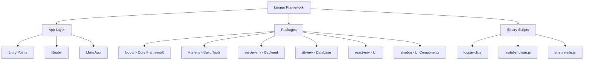

# Introduction to Loopar Framework

Loopar is a powerful drag-and-drop web application framework that combines modern JavaScript technologies to provide a rapid development experience. Built on top of React 19, Vite 7, and Express 5, Loopar enables developers to create full-stack applications with an intuitive visual interface and robust backend capabilities.

## What is Loopar?

Loopar Framework is an open-source, monorepo-based development platform that provides:

- **Visual Development**: Drag-and-drop component builder for rapid UI development
- **Full-Stack Architecture**: Integrated frontend and backend with SSR support
- **Modern Tech Stack**: React 19, Vite 7, Express 5, and Sequelize 7
- **Multi-Tenancy**: Built-in support for multi-site deployments
- **Process Management**: PM2 integration for production-ready deployments
- **Workspace System**: Modular packages architecture using pnpm workspaces

## Key Features

<CardGroup cols={2}>
  <Card title="Component Library" icon="puzzle-piece">
    Pre-built React components including buttons, cards, forms, dialogs, and more - all customizable through a visual interface
  </Card>
  
  <Card title="Database Abstraction" icon="database">
    Sequelize-based ORM supporting MariaDB, MySQL, and SQLite with easy configuration
  </Card>
  
  <Card title="Monorepo Architecture" icon="folder-tree">
    Organized workspace with separate packages for core framework, UI components, database, and utilities
  </Card>
  
  <Card title="Development CLI" icon="terminal">
    Powerful command-line tools for starting, stopping, managing, and monitoring your applications
  </Card>
</CardGroup>

## Who is Loopar For?

Loopar is ideal for:

- **Full-Stack Developers** building modern web applications
- **Teams** needing rapid prototyping and deployment capabilities
- **SaaS Builders** requiring multi-tenancy out of the box
- **Enterprises** looking for a framework with process management and scalability

## Architecture Overview

Loopar follows a modular monorepo architecture:



### Core Components

**App Layer** (`/app`)
- Entry points for client and server-side rendering
- React Router integration
- Main application component with workspace provider

**Packages** (`/packages`)
- **loopar**: Core framework with component system and workspace management
- **vite-env**: Vite configuration and build tools
- **server-env**: Express middleware and server utilities
- **db-env**: Sequelize ORM and database adapters
- **react-env**: React and UI libraries
- **shadcn**: Shadcn UI component library
- **builder**: Build and compression tools
- **markdown**: Markdown editor integration

**Binary Scripts** (`/bin`)
- CLI tools for development and production management
- Site creation and configuration utilities
- PM2 process management integration

## Technology Stack

<CodeGroup>
```json package.json
{
  "name": "loopar-framework",
  "version": "5.0.1",
  "type": "module",
  "engines": {
    "node": ">=22.12.0"
  },
  "workspaces": [
    "packages/*"
  ]
}
```
</CodeGroup>

### Frontend
- **React 19.2.3**: Latest React with concurrent features
- **Vite 7.3.1**: Fast build tool and dev server
- **Shadcn UI**: Modern component library
- **Radix UI**: Accessible component primitives
- **Tailwind CSS**: Utility-first CSS framework
- **Lucide Icons**: Beautiful icon library

### Backend
- **Express 5.2.1**: Web application framework
- **Sequelize 7**: Modern ORM with TypeScript support
- **PM2**: Process manager for Node.js applications
- **Express Session**: Session middleware
- **Multer**: File upload handling

### Development
- **TypeScript**: Type-safe development
- **ESLint & Prettier**: Code quality and formatting
- **pnpm/yarn**: Workspace package management

<Note>
  Loopar requires **Node.js 22.12.0 or higher** to run properly. Make sure your environment meets this requirement before installation.
</Note>

## Multi-Tenancy Support

Loopar includes built-in multi-tenancy with a sites-based architecture:

- Each site has its own configuration, database connection, and environment variables
- Sites are isolated in separate directories under `/sites`
- PM2 manages multiple site processes with namespacing
- Automatic dev site creation during installation

## Next Steps

<CardGroup cols={2}>
  <Card title="Installation" icon="download" href="/installation">
    Install Loopar Framework using npx or manual setup
  </Card>
  
  <Card title="Quick Start" icon="rocket" href="/quickstart">
    Build your first Loopar application in minutes
  </Card>
  
  <Card title="Project Structure" icon="folder" href="/project-structure">
    Understand the framework's directory layout
  </Card>
  
  <Card title="Components" icon="cube" href="/components/overview">
    Explore the built-in component library
  </Card>
</CardGroup>